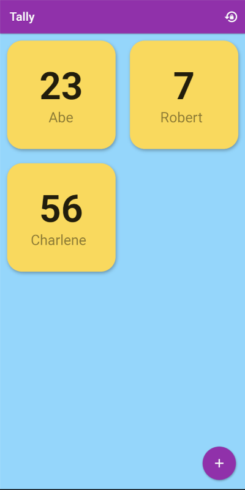

# Tally

A simple web-based Flutter app for keeping track of players and points for board games.

You can use the live version of it at https://cjstehno.github.io/tally

With it you can:
- Use the `+` button to add players.
- Double tap on a player to remove them.
- Tap on a player to update their score (as a raw number `42`, or an adjustment value such as `-10` or `+25`).
- Reset all the scores to '0' with the reset button.

The data is stored in the browser "local storage" system so that as long as you use the same browser, your active scores will be saved even between reloads. On that note, your scores are ONLY on the browser, so nobody else can see them.

It's meant to be simple and ad-free, nothing high-end here. If there is interest in it, I could code up the Android app version and I have considered making it support some sort of server backend for shared scores... but that is for some other time.

Oh, and yes, the color scheme is loud... I wanted something fun for game time. :-)

## Building

To build for release run:

    flutter build web --base-href=/tally/

## Development Running

You can run in development mode with:

    flutter run -d chrome

## Local Running

You can run the local build artifacts using the following, executed in the `build/web` directory:

    python3 -m http.server 8080

## Publish Site

To publish the site, you need to have the `app` branch checked out as a separate clone. Build the web application, as described above and then run the following to copy the artifacts to the site repository:

    rsync -r build/web/* <path_to_app_clone>/

where `<path_to_app_clone>` is the path to your separate clone on the `app` branch.

Then, in the "app clone" commit and push the changes to deploy the site.

## License

Apache 2 I guess.